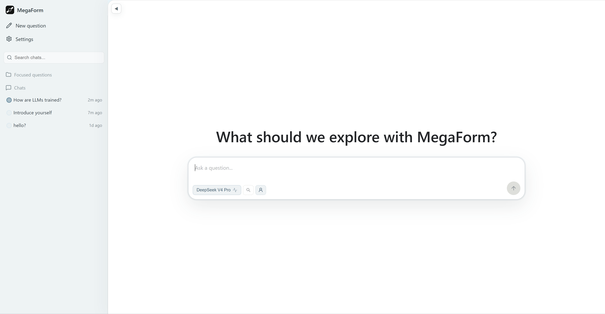
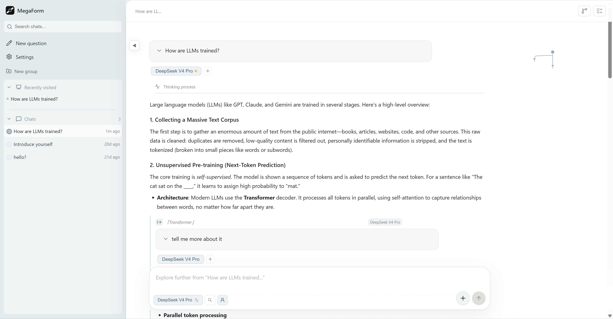

# MegaForm

[简体中文](README.md)

**A multi-model tree-based conversation system for research-style questioning — ask once, get parallel answers, and branch deeper on any thread.**

MegaForm turns the traditional linear Q&A into an expandable, collapsible, deep-linkable **conversation tree**. Compare answers, branch into follow-ups, and backtrack with clarity.




---

## Why MegaForm

Most chat tools are linear: ask, get an answer, and follow-ups pile into one ever-growing context. That breaks down when you need comparison, branching, or backtracking.

| Scenario | Linear chat | MegaForm |
|---|---|---|
| Ask the same question of multiple models | Multiple windows, manual comparison | One question, all answers side by side |
| Follow up on one specific answer | Context mixes with unrelated replies | Each follow-up inherits only its branch |
| Dig deeper on a selected passage | Copy/paste, hope the model remembers | Nut anchors preserve the passage, auto-inject context |
| Review previous exploration paths | Endless scrolling, can't tell paths apart | Tree view with folding and focused navigation |

A typical question tree looks like this:

```text
Root question: "What is the core difference between RLHF and DPO?"
├─ GPT-5 answer
│  └─ Follow-up: "How does the reward model avoid reward hacking in RLHF?"
│     └─ Follow-up: "What alternatives to PPO exist in RLHF?"
├─ Claude Sonnet 4.6 answer
│  └─ Follow-up: "How is DPO's implicit reward formula derived?"
└─ DeepSeek V4 Pro answer
```

---

---

## Quick Start

### Requirements

- Python 3.10+
- Node.js 18+
- npm

### Install

```bash
cd ~/projects/megaform

# Backend dependencies
pip install -r requirements.txt

# Frontend dependencies
cd frontend && npm install && cd ..
```

### Development

Open two terminals:

```bash
# Terminal 1 — Backend (port 8080, auto-reload)
python main.py
```

```bash
# Terminal 2 — Frontend (port 5173, HMR)
cd frontend && npm run dev
```

Visit **http://localhost:5173** — Vite proxies `/api` to the backend automatically.

### Production

```bash
cd frontend && npm run build && cd ..
python main.py
```

Visit **http://localhost:8080** — FastAPI serves both the API and frontend static files.

### Setup

The database `megaform.db` is created and migrated on first launch. Open Settings (⚙️), pick a model provider, enter an API key, and you're ready to go.

---

## Features

### 🌲 Tree Conversations

- **Data model**: `Root → Node → Response → Nut` — precise modeling of "question → answer → follow-up anchor"
- **Progression**: continue along a line of thought, carrying sibling context automatically
- **Follow-up**: select a passage from a response and branch a new question from it
- **Fold & focus**: CSS grid animations, breadcrumb navigation, node-switching transitions

### 🤖 Parallel Multi-Model

- Ask once, get answers from multiple models in parallel — compare side by side
- **10 preset providers**: OpenAI, Anthropic, Gemini, xAI, OpenRouter, DeepSeek, Zhipu, MiniMax, Kimi, Qwen
- Local Ollama models + any OpenAI-compatible endpoint
- Per-conversation model selection, thinking depth, web search, profile injection

### 🔄 SSE Streaming

- Backend LLM calls decoupled from HTTP via `asyncio.create_task`
- Frontend disconnect? Background generation continues. Reconnect restores from SQLite.
- Throttled DB writes, BFS progressive loading for large trees

### 📌 Text Anchors (Nut)

- Select any text in a response → follow-up popup → auto-inject "Regarding your passage 'xxx'..."
- Follow-up cards embedded at the referenced text position
- Three-layer search: direct match → Markdown-normalized → word-level fallback

### 🌐 Web Search

- **5 backends**: Brave, Serper, Tavily, SerpAPI, SearXNG
- **Native model search**: Anthropic web search, Gemini grounding, OpenAI search-preview
- **Tool-calling**: models call `search_web` + `see_web`, up to 7 rounds

### 🧠 Reasoning

- Per-model thinking budgets with visual strength controls
- Streaming thinking output, collapsible display
- Provider-specific parameter adaptation for all major APIs

### 📊 Usage & Cost

- Tracks `tokens_input/output`, `latency_ms`, model, provider per response
- Auto-calculates cost from pricing, accumulates per model
- Character-based token estimation for providers that don't return usage
- Dual currency: ¥ CNY / $ USD

### ✨ More

- **Smart Summaries**: manual / AI-generated node summaries; root summaries auto-refresh daily
- **Deep Links**: share `/root/{id}` and `/node/{id}` URLs; browser back/forward works seamlessly
- **PDF to Markdown**: integrated MinerU for converting PDFs to structured Markdown
- **Multimodal**: image input with automatic capability detection
- **i18n**: Simplified Chinese / English UI with backend prompt alignment
- **Multi-user**: local single-user / email registration / Google OAuth, encrypted API key sharing
- **Profile System**: Markdown background/preferences injected into system prompt; auto-updates daily/weekly
- **Sidebar Groups**: organize question trees into custom groups with drag-and-drop

---

## Tech Stack

| Layer | Technology |
|---|---|
| Backend | Python 3.10+ · FastAPI · uvicorn |
| Database | SQLite (WAL · FTS5 · cascade FKs) |
| Async HTTP | httpx (AsyncClient, SSE) |
| Encryption | cryptography / Fernet (API key encryption) |
| Frontend | React 19 · TypeScript · Vite |
| State | Zustand (localStorage persistence) |
| Markdown | marked.js · KaTeX (LaTeX) · highlight.js |
| UI | HeroUI · lucide-react · @ant-design/icons · framer-motion |

---

## Project Structure

```
megaform/
├── main.py                     # FastAPI entry, route registration
├── app_state.py                # App state: lifespan, helpers, system prompts
├── database.py                 # SQLite schema, CRUD, FTS5, encryption (2743 lines)
├── models.py                   # Multi-provider streaming, search/thinking adaptation (1011 lines)
├── streaming.py                # SSE channel management, reconnection
├── context_builder.py          # Conversation context builder, Nut anchors
├── web_search.py               # 5 search backends + page fetching (337 lines)
├── price_crawler.py            # Automatic price sync
├── auth.py                     # Auth: sessions, email, Google OAuth
├── utility.py                  # Streaming delta merge helpers
├── requirements.txt            # Backend dependencies
├── routes/
│   ├── chat_routes.py          # Streaming chat SSE
│   ├── tree_routes.py          # Question tree CRUD
│   ├── response_routes.py      # Response operations
│   ├── settings_routes.py      # Settings management
│   ├── auth_routes.py          # Auth endpoints
│   ├── import_routes.py        # PDF import (MinerU)
│   └── spa_routes.py           # SPA fallback
└── frontend/
    ├── vite.config.ts          # Vite config, code splitting
    └── src/
        ├── App.tsx             # Root: deep links, layout
        ├── store/appStore.ts   # Zustand state (3094 lines)
        ├── api/client.ts       # REST + SSE client
        ├── types/index.ts      # Type definitions
        ├── i18n.tsx            # Internationalization (zh-CN / en)
        ├── data/
        │   ├── providerPresets.ts   # 10 provider presets
        │   └── thinkingPresets.ts   # Thinking level presets
        └── components/
            ├── Sidebar.tsx     # Sidebar: list, search, groups
            ├── ChatArea.tsx    # Main area: breadcrumbs, tree rendering
            ├── InputBar.tsx    # Input: model select, thinking, search
            ├── NodeCard.tsx    # Node card: fold, edit, rerun
            ├── ResponseArea.tsx # Response: streaming, text selection
            ├── MarkdownContent.tsx # Markdown: syntax, LaTeX, Nut anchors
            ├── FrozenModelBar.tsx  # Frozen model bar
            └── ConfigModal.tsx # Settings: models, search, account
```

---

## Configuration

### Environment

Copy the example file for local setup:

```bash
cp .env.example .env
```

Key variables:

| Variable | Purpose | Default |
|---|---|---|
| `MEGAFORM_AUTH_MODE` | Auth mode: `local` / `oauth` | `local` |
| `MEGAFORM_EMAIL_AUTH` | Enable email registration | `true` |
| `MEGAFORM_SECRET_KEY` | Keep stable in production | auto-generated |
| `MEGAFORM_PUBLIC_BASE_URL` | Public-facing URL | `http://localhost:8080` |
| `GOOGLE_CLIENT_ID` | Google OAuth client ID | — |
| `GOOGLE_CLIENT_SECRET` | Google OAuth client secret | — |

### Model Presets

Open Settings → pick a provider → enter API key → click "Discover models" or choose from presets.

| Provider | Currency | API Key Format |
|---|---|---|
| OpenAI | $ USD | `sk-...` |
| Anthropic | $ USD | `sk-ant-...` |
| Google Gemini | $ USD | `AIza...` |
| xAI (Grok) | $ USD | `xai-...` |
| OpenRouter | $ USD | `sk-or-...` |
| DeepSeek | ¥ CNY | `sk-...` |
| Zhipu AI | ¥ CNY | `.` (API Key) |
| MiniMax | ¥ CNY | `eyJ...` |
| Kimi (Moonshot) | ¥ CNY | `sk-...` |
| Qwen | ¥ CNY | `sk-...` |
| Ollama | — | none |

### Web Search

Configure a search provider in Settings → Web Search:

| Provider | Free tier | Paid |
|---|---|---|
| Brave Search | 2,000/month | $5/1K searches |
| Serper (Google) | 2,500/month | $0.30/1K searches |
| Tavily | 1,000/month | $0.008/search |
| SerpAPI | 100/month | From $50/month |
| SearXNG | Free | Self-hosted |

### Authentication

- **Local mode** (default): no login, single user
- **OAuth mode**: email/password + Google OAuth
- **Shared models**: encrypted API keys, shared across family/team, independent usage tracking

---

## Data Model

```
Root Node (question tree)
 ├─ Node (follow-up / progression)
 │   ├─ Response (model reply)
 │   │   └─ Nut (selected text anchor)
 │   └─ Node ...
 ├─ Node ...
 └─ ...
```

**Key constraints:**
- Delete root → cascade-delete entire question tree
- Delete non-root → cascade-delete node and all descendants
- Model configs use soft deletion, preserving historical answers and usage
- FTS5 indexes cover `nodes.content` / `summary` / `responses.content`

---

## API Reference

### Question Trees

| Method | Path | Description |
|---|---|---|
| `GET` | `/api/roots` | List all question trees |
| `GET` | `/api/roots/{id}` | Read root node |
| `PATCH` | `/api/roots/{id}` | Update root node |
| `DELETE` | `/api/roots/{id}` | Delete entire tree |
| `GET` | `/api/roots/{id}/tree` | Read full tree in one request |
| `GET` | `/api/roots/{id}/tree/stream` | Progressive SSE load (BFS) |

### Nodes

| Method | Path | Description |
|---|---|---|
| `GET` | `/api/nodes/{id}` | Read node with responses |
| `PATCH` | `/api/nodes/{id}` | Update node |
| `DELETE` | `/api/nodes/{id}` | Cascade-delete |
| `GET` | `/api/nodes/{id}/path` | Path to root |
| `POST` | `/api/nodes/{id}/summary` | Set summary manually |
| `POST` | `/api/nodes/{id}/generate-summary` | AI-generated summary |
| `POST` | `/api/nodes/{id}/rerun/stream` | Rerun node (SSE) |

### Streaming Chat

| Method | Path | Description |
|---|---|---|
| `POST` | `/api/chat/stream` | Create node + parallel multi-model SSE |
| `GET` | `/api/chat/stream/{node_id}` | Reconnect to streaming session |
| `POST` | `/api/node/{node_id}/add-model` | Add a model reply to existing node |

### SSE Events

```text
event: node_ready  → {root_id, node_id}
event: model_start → {node_id, model_id, model_name}
event: thinking    → {node_id, model_id, content}
event: content     → {node_id, model_id, content}
event: sources     → {node_id, model_id, sources: [...]}
event: model_done  → {node_id, model_id, tokens_input, ...}
event: model_error → {node_id, model_id, error}
event: done        → {node_id}
```

### Other

| Method | Path | Description |
|---|---|---|
| `GET` | `/api/search?q=...` | FTS5 full-text search |
| `GET` | `/api/models` | List model configs |
| `POST` | `/api/models` | Create / update model |
| `GET` | `/api/me` | Current user info |
| `GET` | `/api/settings` | Read global settings |
| `POST` | `/api/settings` | Batch save settings |
| `GET` | `/api/token-usage` | Usage statistics |

---

## Development

### Build & Verify

```bash
# Clean before build (Vite defaults .js over .tsx)
find frontend/src -name "*.js" -delete
rm -rf static/dist/

# Build
cd frontend && npm run build && cd ..

# Verify built assets contain expected changes
strings static/dist/assets/index-*.js | grep -o 'expectedPattern'
```

### Database Debugging

```bash
sqlite3 megaform.db
.tables
.schema nodes
SELECT id, content FROM nodes WHERE parent_id IS NULL;
```

### Frontend State Flow

```text
App.tsx
  ├─ Init: fetchRoots() / fetchModels() / URL deep-link parsing
  ├─ Open tree: openRoot(rootId) → SSE progressive load
  ├─ Focus node: focusNode(nodeId) → ChatArea render
  ├─ Send: sendingMessage(...) → SSE streaming
  ├─ Follow-up: submitFollowup / submitProgression
  └─ Rerun: rerunNode → SSE rerun stream
```

### Common Pitfalls

- **Vite build order**: always delete stale `.js` artifacts before building — Vite prefers `.js` over `.tsx`
- **SSE metadata**: wrap `onDone` callbacks in `try/finally` to prevent stuck UI state
- **Collapse logic**: each node has a single `collapsed` boolean — folding is independent, no child propagation
- **IME support**: InputBar ignores Enter during composition to avoid accidental submission
- **Gemini endpoint**: always use the native API (`generativelanguage.googleapis.com`); OpenAI-compatible proxies return 400

---

## License

[Apache-2.0](LICENSE) © 2026 MegaForm contributors
