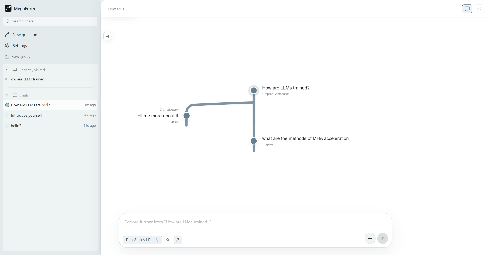

# MegaForm · 巨型问题

[English](README.en.md)

**面向研究型提问的多模型树状对话系统 — 一次提问，多模型并行回答，沿任意分支深入探索。**

把传统线性的「一问一答」组织成可展开、可折叠、可深链接的**对话树**。比较答案、分叉追问、回溯历史，一目了然。




---

## 为什么需要 MegaForm

普通聊天工具是一条线：问一句，答一句，追问继续堆在同一个上下文里。当你需要**比较、分叉、回溯**的时候，线性对话就捉襟见肘了。

| 场景 | 线性聊天 | MegaForm |
|---|---|---|
| 同一问题问多个模型 | 开多个窗口手动比对 | 一个问题，多种回答并列展示 |
| 针对某条回答追问 | 上下文混入不相干的回复 | 追问只继承当前分支，互不干扰 |
| 选中某句话深入挖掘 | 复制粘贴，模型可能遗忘前文 | Nut 锚点精准定位，上下文自动注入 |
| 回顾之前的探索路径 | 向上翻半天，分不清哪条是哪条 | 树状结构一目了然，折叠快速导航 |

一棵典型的问题树长这样：

```
根问题 "RLHF 和 DPO 的本质区别是什么？"
├─ GPT-5 的回答
│  └─ 追问 "RLHF 中的 reward model 如何避免 reward hacking？"
│     └─ 进一步追问 "PPO 在 RLHF 中有什么替代方案？"
├─ Claude Sonnet 4.6 的回答
│  └─ 追问 "DPO 的隐式 reward 公式怎么推导？"
└─ DeepSeek V4 Pro 的回答
```

---

## 快速开始

### 环境要求

- Python 3.10+
- Node.js 18+
- npm

### 安装

```bash
cd ~/projects/megaform

# 后端依赖
pip install -r requirements.txt

# 前端依赖
cd frontend && npm install && cd ..
```

### 开发模式

开两个终端：

```bash
# 终端 1 — 后端（端口 8080，自动重载）
python main.py
```

```bash
# 终端 2 — 前端（端口 5173，热更新）
cd frontend && npm run dev
```

访问 **http://localhost:5173**（Vite 自动代理 `/api` 到后端）。

### 生产模式

```bash
cd frontend && npm run build && cd ..
python main.py
```

访问 **http://localhost:8080**，FastAPI 同时 serve 前端静态文件。

### 配置

数据库 `megaform.db` 首次启动时自动创建。进入前端设置（⚙️），选择模型供应商后填入 API Key 即可开始使用。

详细配置说明见下文。

---

## 核心能力

### 🌲 树状对话

- **数据模型**：`Root → Node → Response → Nut`，精确建模"问题→回答→追问锚点"的关系
- **Progression**（递进探索）：沿着同一思路继续深入，自动纳入兄弟节点上下文
- **Followup**（追问）：选中回答中的一段文字，精准追踪继续提问
- **折叠/展开**：CSS grid 动画，聚焦模式支持面包屑导航 + 节点切换

### 🤖 多模型并行

- 一次提问同时发给多个模型，回答并列展示，方便横向对比
- 内置 **10 个供应商预设**：OpenAI、Anthropic、Gemini、xAI、OpenRouter、DeepSeek、智谱、MiniMax、Kimi、通义千问
- 支持 Ollama 本地模型 + 任意 OpenAI 兼容接口
- 模型选择、思考强度、联网搜索按对话独立切换

### 🔄 SSE 流式输出

- 后端通过 `asyncio.create_task` 解耦 LLM 调用与 HTTP 连接
- 前端断开后后台继续，重连时从数据库恢复，无丢失
- 节流写入 DB，BFS 渐进式加载大树，UI 不阻塞

### 📌 文本锚点（Nut）

- 选中回复中任意文字 → 弹出追问框 → 自动注入"针对你答复的「xxx」这段话"
- 追问卡片嵌入原文对应位置，三层搜索策略精准定位（直接匹配 → Markdown 归一化 → 单词级回退）
- 桌面端浮动弹窗 + 移动端全宽底栏

### 🌐 联网搜索

- **5 种后端**：Brave、Serper、Tavily、SerpAPI、SearXNG
- **原生模型搜索**：Anthropic web search、Gemini grounding、OpenAI search-preview
- **Tool-calling 搜索**：模型自主调用 `search_web` + `see_web`，最多 7 轮

### 🧠 深度思考

- 按模型配置思考预算（budget tokens），前端可视化强度选择
- 思考过程实时流式展示（可折叠 thinking 区域）
- 差异适配各 API 的思考参数格式

### 📊 用量与成本

- 记录 `tokens_input/output`、`latency_ms`、模型和供应商
- 按定价自动估算消费 → 累计到模型表
- 未返回 usage 的供应商按字符数估算 token
- ¥人民币 / $美元双币种

### ✨ 更多特性

- **智能摘要**：自动/手动生成节点摘要，根摘要 debounce 1 小时后凌晨刷新
- **URL 深链接**：`/root/{id}` 和 `/node/{id}` 可分享，浏览器前进/后退无缝
- **PDF 转 Markdown**：集成 MinerU，上传 PDF 后自动转为结构化 Markdown 供模型分析
- **多模态**：支持图片输入（自动检测模型能力）
- **多语言**：简体中文 / English 界面，后端 prompt 联动
- **多用户**：本地单用户 / 邮箱注册 / Google OAuth，API Key 加密共享
- **Profile 系统**：Markdown 编写偏好背景，注入 system prompt，每日/每周自动更新
- **侧边栏分组**：问题树可拖入自定义分组，拖拽排序

---

## 技术栈

| 层级 | 技术 |
|---|---|
| 后端 | Python 3.10+ · FastAPI · uvicorn |
| 数据库 | SQLite (WAL·FTS5·级联外键) |
| 异步 HTTP | httpx (AsyncClient, SSE) |
| 加密 | cryptography / Fernet (API Key 加密) |
| 前端 | React 19 · TypeScript · Vite |
| 状态管理 | Zustand (localStorage 持久化) |
| Markdown | marked.js · KaTeX (LaTeX) · highlight.js |
| UI | HeroUI · lucide-react · @ant-design/icons · framer-motion |

---

## 项目结构

```
megaform/
├── main.py                     # FastAPI 入口，路由注册
├── app_state.py                # 应用状态：lifespan、工具函数、系统 prompt
├── database.py                 # SQLite schema、CRUD、FTS5、加密 (2743 行)
├── models.py                   # 多模型流式调用、搜索/思考适配 (1011 行)
├── streaming.py                # SSE 通道管理、断线恢复
├── context_builder.py          # 对话上下文构建、Nut 锚点
├── web_search.py               # 5 种搜索后端 + 网页抓取 (337 行)
├── price_crawler.py            # 自动价格同步
├── auth.py                     # 认证：session、邮箱、Google OAuth
├── utility.py                  # 流式 delta 合并
├── requirements.txt            # 后端依赖
├── routes/
│   ├── chat_routes.py          # 流式对话 SSE
│   ├── tree_routes.py          # 问题树 CRUD
│   ├── response_routes.py      # 回复操作
│   ├── settings_routes.py      # 设置管理
│   ├── auth_routes.py          # 认证路由
│   ├── import_routes.py        # PDF 导入 (MinerU)
│   └── spa_routes.py           # SPA fallback
└── frontend/
    ├── vite.config.ts          # Vite 配置，代码分割
    └── src/
        ├── App.tsx             # 根组件：深链接、布局
        ├── store/appStore.ts   # Zustand 状态 (3094 行)
        ├── api/client.ts       # REST + SSE 客户端
        ├── types/index.ts      # 类型定义
        ├── i18n.tsx            # 国际化 (zh-CN / en)
        ├── data/
        │   ├── providerPresets.ts   # 10 供应商预设
        │   └── thinkingPresets.ts   # 思考强度预设
        └── components/
            ├── Sidebar.tsx     # 侧边栏：列表、搜索、分组
            ├── ChatArea.tsx    # 主区域：面包屑、树渲染
            ├── InputBar.tsx    # 输入栏：模型选择、思考、搜索
            ├── NodeCard.tsx    # 节点卡片：折叠、编辑、重跑
            ├── ResponseArea.tsx # 回答区：流式渲染、选中追问
            ├── MarkdownContent.tsx # Markdown：代码高亮、LaTeX、Nut
            ├── FrozenModelBar.tsx  # 冻结模型栏
            └── ConfigModal.tsx # 配置：模型、搜索、账户
```

---

## 配置指南

### 环境变量

从示例文件复制一份本地配置：

```bash
cp .env.example .env
```

关键变量：

| 变量 | 说明 | 默认值 |
|---|---|---|
| `MEGAFORM_AUTH_MODE` | 认证模式：`local` / `oauth` | `local` |
| `MEGAFORM_EMAIL_AUTH` | 邮箱注册开关 | `true` |
| `MEGAFORM_SECRET_KEY` | 密钥（生产环境必设） | 自动生成 |
| `MEGAFORM_PUBLIC_BASE_URL` | 公开访问 URL | `http://localhost:8080` |
| `GOOGLE_CLIENT_ID` | Google OAuth ID | — |
| `GOOGLE_CLIENT_SECRET` | Google OAuth Secret | — |

### 模型配置

进入前端设置 → 选择供应商预设 → 填入 API Key → 点击「发现模型」获取可用列表，或从预设列表直接选择。

支持的供应商预设：

| 供应商 | 货币 | API Key 格式 |
|---|---|---|
| OpenAI | $ USD | `sk-...` |
| Anthropic | $ USD | `sk-ant-...` |
| Google Gemini | $ USD | `AIza...` |
| xAI (Grok) | $ USD | `xai-...` |
| OpenRouter | $ USD | `sk-or-...` |
| DeepSeek | ¥ CNY | `sk-...` |
| 智谱 AI | ¥ CNY | `.` (API Key) |
| MiniMax | ¥ CNY | `eyJ...` |
| Kimi (Moonshot) | ¥ CNY | `sk-...` |
| 通义千问 | ¥ CNY | `sk-...` |
| Ollama | — | 无需 |

### 联网搜索

在设置中配置搜索供应商和 API Key：

| 供应商 | 免费额度 | 付费 |
|---|---|---|
| Brave Search | 2,000/月 | $5/1K 次 |
| Serper (Google) | 2,500/月 | $0.30/1K 次 |
| Tavily | 1,000/月 | $0.008/次 |
| SerpAPI | 100/月 | $50/月起 |
| SearXNG | 免费 | 自托管 |

### 认证

- **本地模式**（默认）：无需登录，单用户
- **OAuth 模式**：支持邮箱注册 + Google OAuth 一键登录
- **模型共享**：API Key 加密存储，家庭成员可共享，独立用量追踪

---

## 数据模型

```
Root Node (问题树)
 ├─ Node (追问/递进)
 │   ├─ Response (模型回复)
 │   │   └─ Nut (选中文本锚点)
 │   └─ Node ...
 ├─ Node ...
 └─ ...
```

**关键约束：**
- 删除根节点 → 级联删除整棵问题树
- 删除非根节点 → 级联删除该节点及所有后代
- 模型配置软删除，保留历史回答和用量
- FTS5 全文索引覆盖 `nodes.content` / `summary` / `responses.content`

---

## API 参考

### 问题树

| 方法 | 路径 | 说明 |
|---|---|---|
| `GET` | `/api/roots` | 列出所有问题树 |
| `GET` | `/api/roots/{id}` | 读取根节点 |
| `PATCH` | `/api/roots/{id}` | 更新根节点 |
| `DELETE` | `/api/roots/{id}` | 删除整棵问题树 |
| `GET` | `/api/roots/{id}/tree` | 一次性读取完整树 |
| `GET` | `/api/roots/{id}/tree/stream` | SSE 渐进加载 (BFS) |

### 节点

| 方法 | 路径 | 说明 |
|---|---|---|
| `GET` | `/api/nodes/{id}` | 读取节点（含回复） |
| `PATCH` | `/api/nodes/{id}` | 更新节点 |
| `DELETE` | `/api/nodes/{id}` | 级联删除 |
| `GET` | `/api/nodes/{id}/path` | 到根节点的路径 |
| `POST` | `/api/nodes/{id}/summary` | 手动设置摘要 |
| `POST` | `/api/nodes/{id}/generate-summary` | AI 生成摘要 |
| `POST` | `/api/nodes/{id}/rerun/stream` | 重跑节点 (SSE) |

### 流式对话

| 方法 | 路径 | 说明 |
|---|---|---|
| `POST` | `/api/chat/stream` | 创建节点 + 多模型并行流式 |
| `GET` | `/api/chat/stream/{node_id}` | 断线重连恢复 |
| `POST` | `/api/node/{node_id}/add-model` | 追加模型回复 |

### SSE 事件

```text
event: node_ready  → {root_id, node_id}
event: model_start → {node_id, model_id, model_name}
event: thinking    → {node_id, model_id, content}
event: content     → {node_id, model_id, content}
event: sources     → {node_id, model_id, sources: [...]}
event: model_done  → {node_id, model_id, tokens_input, ...}
event: model_error → {node_id, model_id, error}
event: done        → {node_id}
```

### 其他

| 方法 | 路径 | 说明 |
|---|---|---|
| `GET` | `/api/search?q=...` | FTS5 全文搜索 |
| `GET` | `/api/models` | 列出模型配置 |
| `POST` | `/api/models` | 新增/更新模型 |
| `GET` | `/api/me` | 当前用户信息 |
| `GET` | `/api/settings` | 读取全局设置 |
| `POST` | `/api/settings` | 批量保存设置 |
| `GET` | `/api/token-usage` | 用量统计 |

---

## 开发

### 构建与验证

```bash
# 构建前清理（Vite 默认 .js 优先于 .tsx）
find frontend/src -name "*.js" -delete
rm -rf static/dist/

# 构建
cd frontend && npm run build && cd ..

# 验证构建产物包含关键改动
strings static/dist/assets/index-*.js | grep -o '关键字符串'
```

### 数据库调试

```bash
sqlite3 megaform.db
.tables
.schema nodes
SELECT id, content FROM nodes WHERE parent_id IS NULL;
```

### 前端状态流

```text
App.tsx
  ├─ 初始化: fetchRoots() / fetchModels() / URL 深链接解析
  ├─ 打开问题树: openRoot(rootId) → SSE 渐进加载
  ├─ 聚焦节点: focusNode(nodeId) → ChatArea 渲染
  ├─ 发送消息: sendingMessage(...) → SSE 流式对话
  ├─ 追问: submitFollowup / submitProgression
  └─ 重跑: rerunNode → SSE 重跑流
```

### 常见陷阱

- **Vite 构建**：务必先删除 `.js` 编译产物，Vite 默认 `.js` 优先于 `.tsx`
- **流式元数据**：`onDone` 回调必须 `try/finally`，否则状态卡死
- **折叠逻辑**：每个节点仅一个 `collapsed` 布尔，折叠独立不波及子节点
- **中文输入法**：InputBar 在 composition 期间忽略 Enter，避免误提交
- **Gemini 端点**：走原生 API (`generativelanguage.googleapis.com`)，避免 OpenAI 兼容端点 400 错误

---

## License

[Apache-2.0](LICENSE) © 2026 MegaForm contributors
